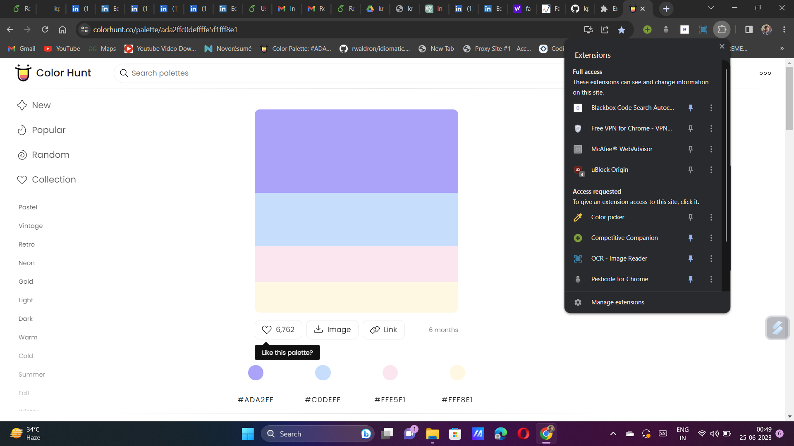
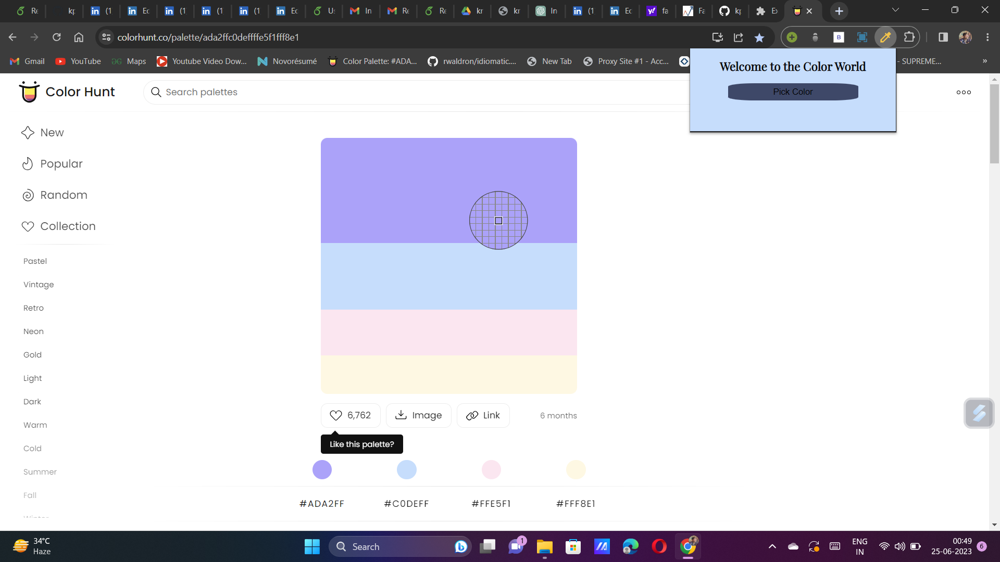
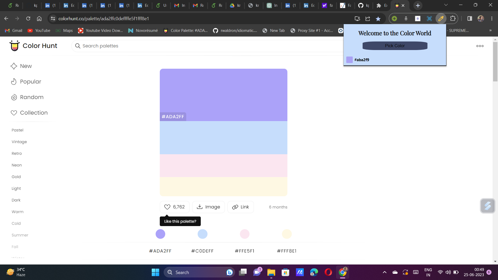

# Chrome-Extension-To-Pick-Color
# Introduction
The Color Picker Chrome Extension is a useful tool that allows users to easily extract and identify colors from any webpage.  With just a few clicks, users can select any element on a webpage and obtain the corresponding color code, making it ideal for designers, developers, and anyone working with colors in their projects.
# Features
Color Extraction: The extension provides a simple and intuitive way to extract colors from webpages. Users can click on any element to instantly capture its color. 
Color Information: Along with the color code, the extension displays additional information such as RGB, HEX, and HSL values for the selected color. 
Color Palette: Users can create and save a color palette by adding colors they've extracted from different webpages. 
Copy to Clipboard: The extension allows users to copy the color code with just one click, making it convenient for quick access and integration into their projects. 
# Installation
Open the Chrome browser on your computer. 
Go to the Chrome Manage Extension. 
At the top right open developer mode after that Load Unpacked button shown. 
Add files provided above in Unpaced Your Extension Start Working. 
#Demo of Extension
 
 
 

